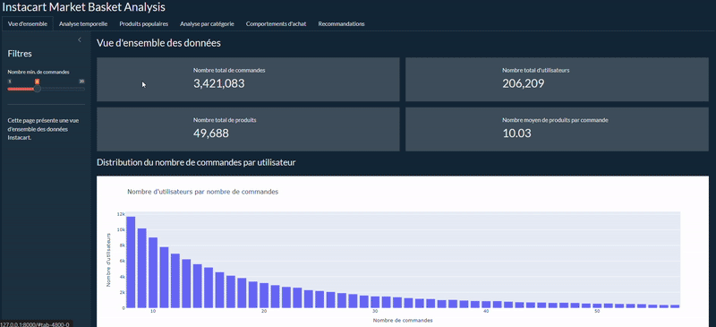

# 📊 Tableau de Bord d'Analyse de Panier Instacart

## 🚀 Présentation du Projet
Ce tableau de bord offre une analyse comprehensive des données de panier d'Instacart, un service de livraison de courses permettant aux clients de commander en ligne des produits alimentaires et de les recevoir à domicile. L'analyse révèle des insights précieux sur les comportements d'achat des utilisateurs, leurs préférences de produits et leurs habitudes de commande à travers des visualisations détaillées.

## Démo de l'application



### 🔍 Fonctionnalités Principales

#### 1. Visualisation et Analyse de Données
- **Vue d'Ensemble** :
  - Statistiques globales sur les commandes, utilisateurs et produits
  - Distribution du nombre de commandes par utilisateur
- **Analyse Temporelle** :
  - Distribution des commandes par jour de la semaine
  - Distribution horaire des commandes
  - Heatmap des modèles de commandes
- **Produits et Catégories** :
  - Top 20 des produits les plus commandés
  - Analyse des taux de réachat
  - Répartition des commandes par rayon et département
- **Comportements d'Achat** :
  - Taille moyenne du panier par jour de la semaine
  - Taille moyenne du panier par heure

#### 2. Recommandations Personnalisées
- Suggestions de produits basées sur l'historique d'achat de l'utilisateur
- Recommandations par similarité de rayons

### 🛠 Technologies et Outils

- **Backend** :
  - Python
  - SQLAlchemy
  - Plotly
- **Frontend** :
  - Shiny pour Python
  - Interface basée sur Shinyswatch
- **Base de Données** : PostgreSQL
- **Gestion de Dépendances** : `uv` et `pyproject.toml`

### 💡 Points Techniques Remarquables

#### Optimisation de la Base de Données
- **Indexation Stratégique** :
  - Création d'index ciblés sur les colonnes fréquemment utilisées dans les jointures et les filtres
  - Optimisation des recherches par `user_id`, `product_id` et critères temporels (`order_dow`, `order_hour_of_day`)
- **Vues Matérialisées** :
  - Précalcul des requêtes complexes et fréquemment exécutées
  - Réduction drastique du temps de réponse pour les analyses de produits et d'historique utilisateur
- **Procédures et Fonctions SQL** :
  - Encapsulation de la logique métier dans des fonctions dédiées
  - Procédure automatisée pour le rafraîchissement des vues matérialisées

#### Autres Optimisations
- Requêtes SQL optimisées
- Mécanisme de cache avec `lru_cache`
- Système de journalisation détaillé
- Gestion robuste des erreurs
- Pool de connexions à la base de données

### 🔧 Installation et Configuration

1. Clonez le dépôt
```bash
git clone https://github.com/francoisvercellotti/instacart-analysis-shiny.git
deactivate
cd instacart-analysis
```

2. Configurez l'environnement avec `uv`
```bash
uv venv
source .venv/bin/activate
uv pip install -r requirements.txt
```

3. Configurez le fichier `.env`
```
DB_USER=your_username
DB_PASSWORD=your_password
DB_HOST=your_host
DB_PORT=your_port
DB_NAME=your_database_name
```

4. Lancez l'application
```bash
uv run app.py
```

### 📝 Conclusion

Ce projet représente une exploration technique approfondie de l'analyse de données de consommation. Il démontre ma capacité à transformer des données brutes en visualisations informatives, en combinant des compétences en développement backend, analyse de données et visualisation.

#### 🔍 Points Clés

- **Développement Technique** : Mise en œuvre de solutions performantes avec Python, SQLAlchemy et Plotly
- **Analyse de Données** : Création d'un tableau de bord révélant des insights sur les comportements d'achat
- **Optimisation de Base de Données** : Implémentation d'une stratégie d'indexation et de matérialisation pour des performances exceptionnelles
- **Approche Méthodologique** : Conception d'une application centrée sur la génération de valeur analytique

#### 🚀 Perspectives

Ce projet est un prototype démontrant comment des outils d'analyse de données peuvent aider les entreprises à mieux comprendre leurs clients et optimiser leurs stratégies.

Un tremplin vers des développements plus avancés en analyse prédictive et systèmes de recommandation.

### 📜 Licence

Projet personnel - © 2025